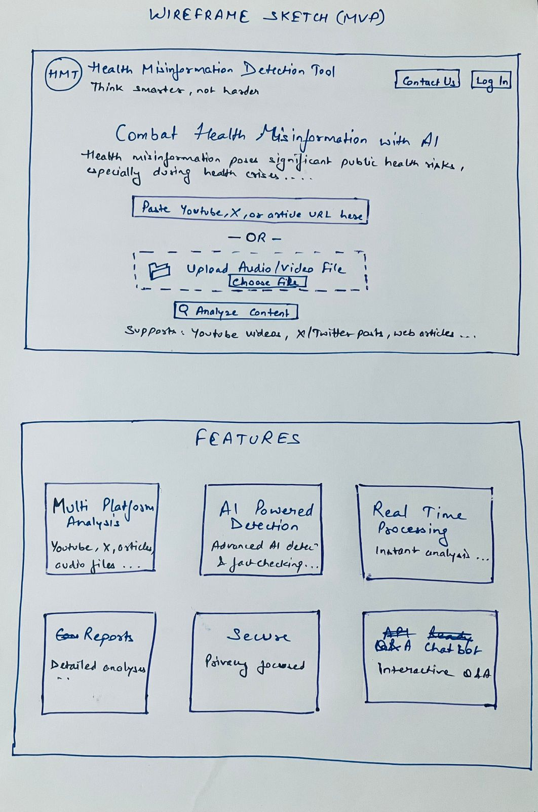
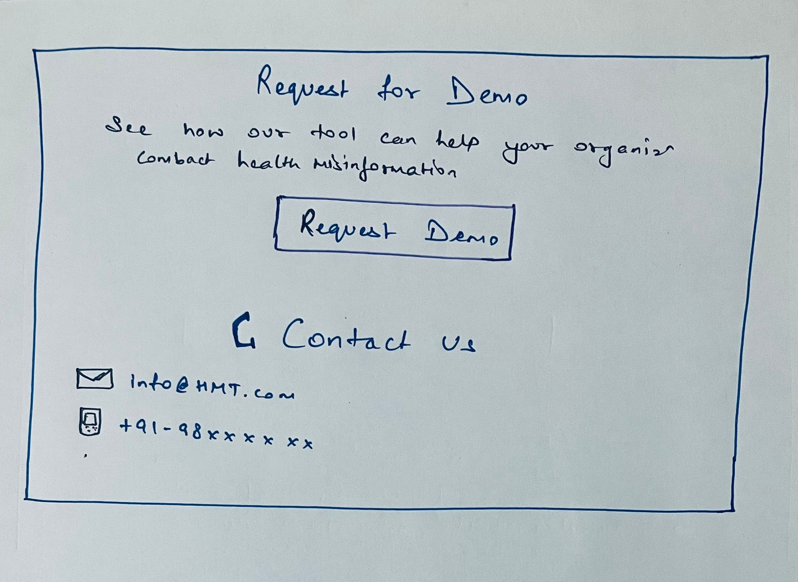
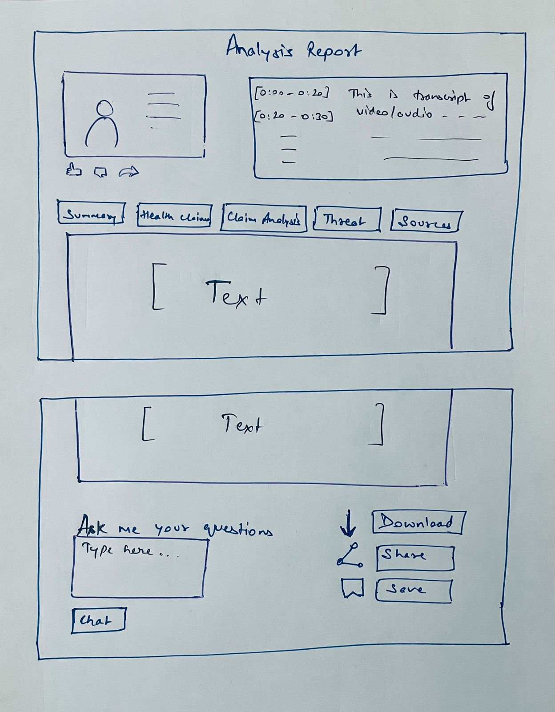

# Health Misinformation Detection Tool
*AI-powered content analysis platform for identifying and categorizing health misinformation across multiple media formats*

## Product Overview

The tool addresses the critical challenge of health misinformation by providing automated detection and analysis across multiple content formats including YouTube videos, Twitter posts, web articles, and audio files.

### Key Impact
- **Automated Detection**: AI-powered identification of health misinformation claims
- **Multi-Format Processing**: Supports video, audio, and text content
- **Real-time Analysis**: Instant threat assessment and fact-checking
- **Scalable Solution**: Handles high-volume content processing

## 🎨 System Design & User Experience

### Wireframe Overview
The system follows a user-centered design approach with intuitive content input and comprehensive analysis output:



*Main interface wireframe showing the home screen*


*Comprehensive report of the analysis*

The wireframe demonstrates:
- **Clean Input Interface**: Simple content URL/file upload mechanism
- **Multi-Platform Support**: YouTube, Twitter, web articles, and audio files
- **Feature-Rich Analysis**: AI-powered detection with real-time processing
- **Comprehensive Reporting**: Detailed analysis with threat assessment

## Core Features

### 1. Multi-Platform Content Processing
- **YouTube Videos**: Audio extraction and transcription
- **Twitter/X Videos**: Direct video processing
- **Web Articles**: Dynamic and static content scraping
- **Audio Files**: Direct file upload and analysis

### 2. AI-Powered Analysis
- **Content Transcription**: OpenAI Whisper for speech-to-text transcription 
- **Claim Detection**: GPT-4 powered health claim identification and analysis
- **Fact Verification**: Automated fact-checking of health claims against scientific information 
- **Threat Assessment**: Risk categorization based on viral potential and harm factor

### 3. Comprehensive Misinformation Categories
- Vaccine-related misinformation
- Pandemic and disease claims
- Diet and nutrition misinformation
- Cancer treatment false claims
- Alternative medicine misinformation
- Mental health misconceptions
- Anti-medical treatment content

## Technical Architecture

### System Components
```
User Input → Flask Web App → Processing Modules → AI Analysis → Results Storage
```

### Core Technologies
- **OpenAI Whisper**: Speech-to-text transcription
- **GPT-4**: Content analysis and fact-checking
- **Flask**: Web application framework
- **Selenium**: Dynamic web content scraping
- **YouTube API**: Video metadata extraction
- **Google Sheets API**: Data storage and tracking

### Processing Pipeline
1. **Content Extraction**: Download/scrape content from various sources
2. **Transcription**: Convert audio/video to text using Whisper
3. **Analysis**: Identify health claims using GPT-4
4. **Verification**: Cross-reference with scientifically backed sources
5. **Assessment**: Categorize threat level and viral potential
6. **Storage**: Save results with metadata tracking

## Key Capabilities

### Threat Level Assessment
- **Critical**: Extremely dangerous, high viral potential
- **High**: Significant public health impact
- **Moderate**: Noticeable misinformation spread
- **Low**: Minimal impact risk

### Content Analysis Features
- Health claim extraction and categorization
- Source credibility assessment
- Target audience identification
- Viral potential prediction
- Thumbnail/visual content analysis
- Social engagement metrics integration

### Interactive Q&A System
- Users can ask questions about analyzed content
- Context-aware responses using original transcripts

## Business Impact

### Problem Solved
Health misinformation poses significant public health risks, especially during health crises. This system provides:
- **Automated Detection**: Significantly reduces manual review workload
- **Scalable Analysis**: Handles large volumes of content
- **Real-time Processing**: Enables rapid response to emerging threats
- **Data-Driven Insights**: Provides actionable intelligence

### Use Cases
- **Public Health Organizations**: Monitor misinformation trends for infodemic management 
- **Content Platforms**: Automated content moderation
- **Research Institutions**: Study misinformation patterns
- **Healthcare Providers**: Counter false medical claims
- **Fact-Checking organizations**: Fasten the health information verification

## Technical Implementation

### File Structure
- **`Health_G_Sheet.py`**: Core processing engine
- **`Scraping_New.py`**: Web content extraction
- **`Flask_YT_N_Article.py`**: Web interface and orchestration

### Key Functions
- **Audio Processing**: Whisper AI based transcription with timestamps
- **Content Scraping**: Dynamic and static web content extraction
- **AI Analysis**: OpenAI GPT-4 powered claim detection and fact-checking
- **Data Storage**: Google Sheets integration for results tracking

## Product Strategy

### Current Capabilities
- Multi-format content processing
- AI-powered analysis and categorization
- Web-based user interface
- Data persistence and tracking
- Interactive Q&A functionality

### Future Roadmap
- **Advanced Analytics**: Trend analysis and reporting dashboard
- **Multi-language Support**: Expand beyond English content
- **Automated Alerts**: Notification system for high-threat content
- **API Integration**: Connect with external platforms
